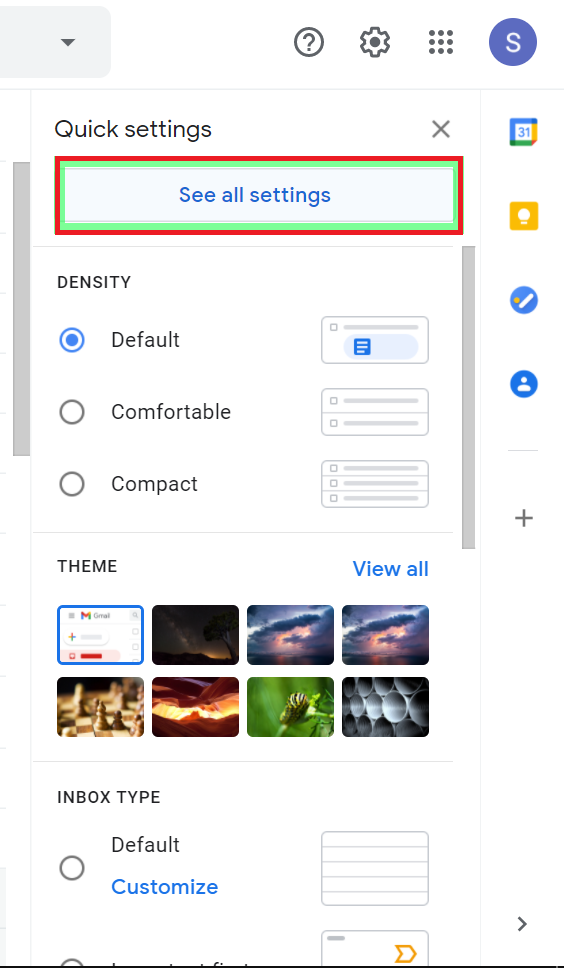
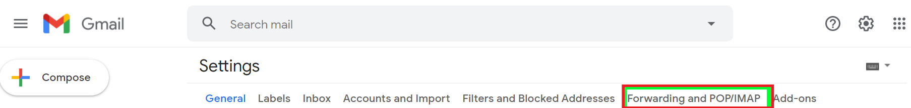
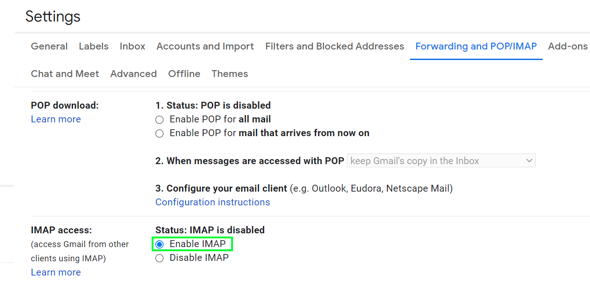

# Email-Node.js
## Now you can send mails through Node.js using nodemailer package.
<hr>

## Steps to be followed first before running the code 
1. Open Your Google Gmail, and click on setting button.

2. Click on `See all settings`.
    

3. Click on `Forwarding and POP/IMAP`.
    

4. Enable IMAP
    

5. Now visit this link `https://myaccount.google.com/lesssecureapps?pli=1&rapt=AEjHL4PkGzhj05Mm6DQ0qCzL72ds1G2NdJ8slS41-AvoTnjOeUdUc1U1o_2ecrq1rHQOWKUrRjd6X3sf6iczjPZWONugteJZHg`
  

6. Now you can run Node.js code

<hr>

## Dependecy - Nodemailer 
```
$ npm i nodemailer 
```
<hr>

## Cloning this repositary using command line
 1. Open **Git Bash**.
 1. Change the current working directory to the location where you want the cloned directory.
 1. Type `git clone https://github.com/Sagar-Sharma-7/Email-Node.js.git`
 1. Press **Enter** to create the clone of this repositary.

<hr><hr>

## License 
### The scripts and documentation in this project are released under the MIT License 


<br>

## Contributions
### Contributions are welcome! see [Contribution's Guide](https://github.com/Sagar-Sharma-7/Email-Node.js/blob/main/CONTRIBUTING.md)

<br>

## Code of Conduct 
 

### Be nice. See our [code of conduct](https://github.com/Sagar-Sharma-7/Covid19-Tracker-Countries/blob/main/CODE_OF_CONDUCT.md)

<br>
<hr>

 ## How to reach me?
 [ ](mailto:6969sagarsharma@gmail.com)
 <hr>
 <br>


[](https://github.com/Sagar-Sharma-7)
[ ](https://github.com/Sagar-Sharma-7)


[](https://github.com/Sagar-Sharma-7)
[](https://github.com/Sagar-Sharma-7)

